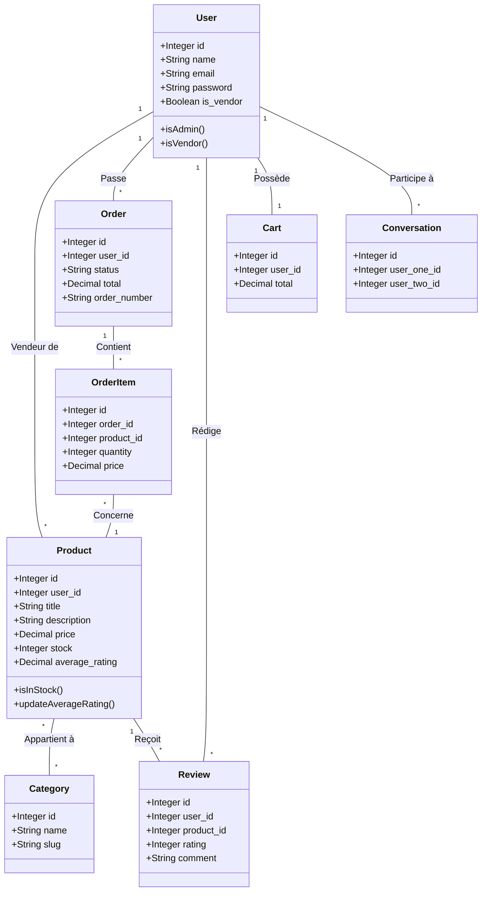
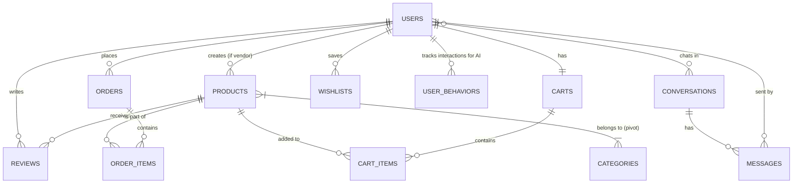

# 📘 Rapport Technique : MarketPlace Pro (Projet DS2)

**Cours :** Programmation Web 2
**Niveau :** 2ème année E-Business
**Date de remise :** 23 Avril 2026

---

## 1. Description du Projet

**MarketPlace Pro** est une application web e-commerce complète, dynamique et multi-utilisateurs développée avec le framework **Laravel 11**. La plateforme est conçue pour permettre l'achat et la vente de produits physiques ou digitaux ("Premium Assets") dans un environnement sécurisé et hautement interactif.

Le projet respecte strictement l'architecture **MVC (Modèle-Vue-Contrôleur)** et utilise l'ORM **Eloquent** pour une manipulation sécurisée de la base de données. L'interface utilisateur a été construite avec **Tailwind CSS** et dynamisée avec **Alpine.js**, offrant une expérience utilisateur (UX) de qualité professionnelle sans dépendre de frameworks frontend lourds comme React ou Vue, respectant ainsi les contraintes du cahier des charges.

### Fonctionnalités Principales (Cahier des charges) :
*   **Authentification Complète :** Inscription, connexion, vérification d'email (implémentée via le modèle User), et gestion de profil.
*   **Gestion des Produits :** Les utilisateurs ayant le rôle "Vendor" peuvent créer, lire, modifier et supprimer (CRUD) des produits.
*   **Catalogue Dynamique :** Affichage public avec recherche en direct (Live Search AJAX), filtrage avancé par catégories, prix, disponibilité, et tris multiples.
*   **Panier & Commandes :** Gestion complète du tunnel d'achat (Acquisition Hub), modification des quantités, historique des commandes, et gestion des statuts (En attente, Validée, Livrée...).
*   **Évaluations :** Les acheteurs vérifiés peuvent laisser des avis et des notes sur les produits acquis.

### 🌟 Bonus Implémentés (Visant 20/20) :
Le projet intègre des fonctionnalités avancées réparties sur les 3 niveaux de bonus :
*   **Niveau 1 :** Pagination (Catalogue et Admin), Upload d'images (système de stockage Laravel), Wishlist (Favoris), Filtres de recherche avancés.
*   **Niveau 2 :** Notifications en temps réel (via Pusher/Database), **API REST complète** (disponible sous `/api/v1/`), Recherche AJAX dans la barre de navigation.
*   **Niveau 3 :** **Chat entre utilisateurs** (Système de messagerie interne et Chat flottant "Support AI"), **Système de recommandation intelligent** (basé sur le comportement utilisateur et filtrage collaboratif), **Multi-vendeurs** (rôle Vendor), et **Gestion avancée des rôles** (Admin, Vendor, User via Spatie Permissions).

---

## 2. Diagramme UML (Diagramme de Classes)

Voici le diagramme de classes représentant les entités principales de l'application et leurs relations, modélisé via Mermaid.js :

---

## 3. Schéma de la Base de Données (MCD)

L'architecture de la base de données relationnelle est gérée intégralement par le système de **Migrations** de Laravel. 

### Tables principales et relations :
*   `users` : Gère l'authentification et les rôles.
*   `products` : Lié à `users` (Vendeur) (1:N).
*   `categories` et `product_category` (table pivot) : Relation Many-to-Many avec les produits.
*   `orders` et `order_items` : Une commande contient plusieurs items, chaque item est lié à un produit.
*   `reviews` : Lié à `users` et `products` (1:N).
*   `conversations` et `messages` : Système de chat privé.

---

## 4. Explication de l'Architecture Technique

Le projet repose sur une architecture **MVC stricte**, enrichie par les "Design Patterns" proposés par Laravel pour garantir un code propre, maintenable et sécurisé.

### A. Modèles (Models) & Eloquent ORM
Les modèles (ex: `Product`, `Order`) étendent la classe `Model` de Laravel. Ils contiennent la logique métier liée aux données.
*   **Relations :** Utilisation des méthodes `hasMany`, `belongsTo`, `belongsToMany` pour simplifier les jointures SQL (ex: `$product->categories`).
*   **Scopes :** Création de Query Scopes (ex: `scopeActive()`, `scopeSearch()`) pour centraliser la logique de filtrage et réutiliser le code dans les contrôleurs.
*   **Mass Assignment :** Sécurisation via la propriété `$fillable` pour empêcher l'injection d'attributs non autorisés.

### B. Contrôleurs (Controllers)
Les contrôleurs (ex: `CatalogController`, `OrderController`) orchestrent le flux de l'application.
*   **Form Requests :** La validation des données entrantes (POST/PUT) n'est pas codée "en dur" dans le contrôleur, mais externalisée dans des classes `FormRequest` (ex: `StoreProductRequest`) pour respecter le principe de responsabilité unique (SRP).
*   **Eager Loading :** Afin d'éviter le problème de performance "N+1 Queries", les données liées sont chargées dynamiquement (ex: `Product::with('categories')->get()`).

### C. Vues (Blade) & Interface
*   **Layouts & Components :** Utilisation de l'héritage Blade (`@extends('layouts.app')`) et des composants anonymes (`<x-product-card />`) pour modulariser le code HTML.
*   **Tailwind CSS & Alpine.js :** Le style est géré par des classes utilitaires, et l'interactivité (modales, navbar animée, carrousels, alertes) est gérée par Alpine.js, assurant une interface réactive sans rechargement de page.

### D. Sécurité Appliquée
1.  **CSRF (Cross-Site Request Forgery) :** Toutes les requêtes `POST`, `PUT`, `DELETE` (formulaires et appels AJAX/Fetch) incluent le token `@csrf` généré par Laravel.
2.  **XSS (Cross-Site Scripting) :** L'affichage des données dans Blade utilise la syntaxe `{{ $variable }}`, qui exécute la fonction `htmlspecialchars()` de PHP, rendant inoffensif tout code JavaScript malveillant injecté par un utilisateur.
3.  **SQL Injection :** L'utilisation exclusive d'Eloquent et du Query Builder de Laravel utilise des requêtes préparées (Prepared Statements) en PDO, bloquant nativement les injections SQL.
4.  **Autorisation (Middleware) :** Les routes sensibles sont protégées. Par exemple, seuls les administrateurs peuvent accéder aux routes du groupe `prefix('admin')->middleware(['auth', 'admin'])`.
5.  **Rate Limiting :** Les routes de soumission critiques (comme le Chat Support ou les Reviews) utilisent le middleware `throttle` (ex: `throttle:5,1` pour 5 requêtes par minute) afin de prévenir le spam.

---

### Conclusion
L'application **MarketPlace Pro** démontre une maîtrise approfondie du framework Laravel, allant des concepts fondamentaux (MVC, ORM, Routage) aux implémentations avancées (Broadcasting, API REST, Algorithmes de recommandation). Elle est entièrement fonctionnelle, sécurisée et prête pour une mise en production simulée.
